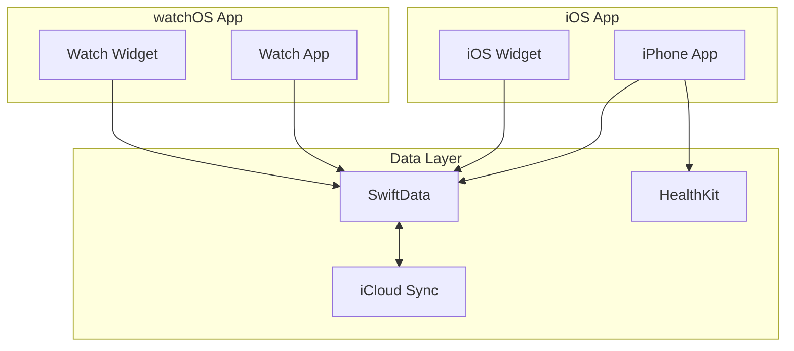
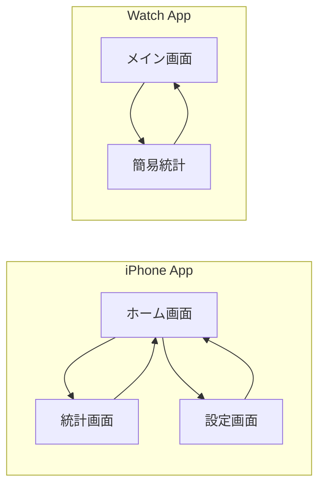
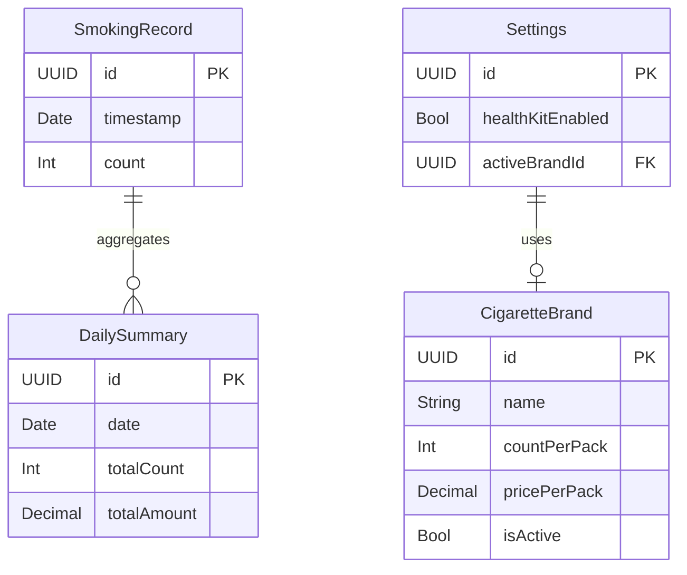

# SmokeCounter 要件定義書

## 1. 目的

1日の喫煙本数を手軽にカウントし、節煙につなげることを目的とする。

## 2. 対象プラットフォーム

| プラットフォーム | 最小バージョン | 備考 |
|----------------|--------------|------|
| iOS | 17.0+ | iPhone メインアプリ |
| watchOS | 10.0+ | Apple Watch アプリ |

## 3. 機能要件

### 3.1 カウント機能

| 機能ID | 機能名 | 詳細 |
|--------|-------|------|
| CNT-001 | カウントアップ | 喫煙時にワンタップでカウントを+1する |
| CNT-002 | カウントダウン | 誤操作時にカウントを-1できる |
| CNT-003 | 日次リセット | 毎日0時に自動的にカウントをリセットする |
| CNT-004 | 手動リセット | ユーザーが任意のタイミングでリセットできる |

### 3.2 ウィジェット機能

| 機能ID | 機能名 | 詳細 |
|--------|-------|------|
| WDG-001 | iOSウィジェット表示 | ホーム画面に今日のカウントを表示 |
| WDG-002 | iOSウィジェット操作 | ウィジェットからカウントアップ可能 |
| WDG-003 | watchOSウィジェット | Apple Watchの文字盤にカウントを表示 |
| WDG-004 | watchOSコンプリケーション | 文字盤からアプリへ素早くアクセス |

### 3.3 統計・グラフ機能

| 機能ID | 機能名 | 詳細 |
|--------|-------|------|
| STS-001 | 日別グラフ | 過去の日別喫煙本数を棒グラフで表示 |
| STS-002 | 月別グラフ | 月ごとの合計本数を折れ線グラフで表示 |
| STS-003 | 年間グラフ | 年間の推移をグラフで表示 |
| STS-004 | 期間選択 | 表示する期間を選択できる |
| STS-005 | 平均値表示 | 期間内の1日あたり平均本数を表示 |

### 3.4 銘柄・金額管理機能

| 機能ID | 機能名 | 詳細 |
|--------|-------|------|
| BRD-001 | 銘柄登録 | タバコの銘柄名を登録できる |
| BRD-002 | 価格設定 | 1箱あたりの価格を設定できる |
| BRD-003 | 本数設定 | 1箱あたりの本数を設定できる |
| BRD-004 | 金額算出 | 喫煙本数から消費金額を自動算出 |
| BRD-005 | 累計金額表示 | 日別・月別・年間の累計金額を表示 |

### 3.5 HealthKit連携機能

| 機能ID | 機能名 | 詳細 |
|--------|-------|------|
| HLT-001 | HealthKit認証 | HealthKitへのアクセス許可を取得 |
| HLT-002 | データ登録 | 喫煙データをHealthKitに登録 |
| HLT-003 | 連携ON/OFF | HealthKit連携の有効/無効を切り替え |

### 3.6 データ同期機能

| 機能ID | 機能名 | 詳細 |
|--------|-------|------|
| SYN-001 | iCloud同期 | iPhone-Watch間でデータを自動同期 |
| SYN-002 | バックアップ | iCloudにデータを自動バックアップ |
| SYN-003 | 復元 | iCloudからデータを復元 |

## 4. 非機能要件

### 4.1 パフォーマンス

| 項目 | 要件 |
|-----|------|
| アプリ起動時間 | 2秒以内 |
| カウント操作レスポンス | 即時（0.1秒以内） |
| グラフ描画時間 | 1秒以内 |

### 4.2 データ

| 項目 | 要件 |
|-----|------|
| データ保存方式 | SwiftData（ローカル） |
| データ同期方式 | iCloud（CloudKit） |
| データ保持期間 | 無期限 |

### 4.3 セキュリティ

| 項目 | 要件 |
|-----|------|
| データ暗号化 | iCloudの暗号化機能を利用 |
| プライバシー | HealthKitデータへのアクセスは明示的な許可が必要 |

### 4.4 ユーザビリティ

| 項目 | 要件 |
|-----|------|
| アクセシビリティ | VoiceOver対応 |
| ダークモード | システム設定に連動 |
| 多言語対応 | 日本語（初期リリース） |

## 5. アーキテクチャ

### 5.1 全体構成

### 5.2 採用アーキテクチャ

- **パターン**: MVVM（Model-View-ViewModel）
- **理由**: SwiftUIとの親和性が高く、テスタビリティを確保できる

### 5.3 レイヤー構成

| レイヤー | 責務 |
|---------|-----|
| View | UI表示、ユーザー操作の受付 |
| ViewModel | UIロジック、状態管理 |
| Model | データ構造、ビジネスロジック |
| Repository | データアクセス、外部サービス連携 |

## 6. 画面構成

### 6.1 iPhone アプリ

| 画面ID | 画面名 | 概要 |
|--------|-------|------|
| SCR-001 | ホーム画面 | 今日のカウント表示、カウントアップボタン |
| SCR-002 | 統計画面 | 日別・月別・年間グラフ、金額集計 |
| SCR-003 | 設定画面 | 銘柄設定、金額設定、HealthKit連携 |

### 6.2 Apple Watch アプリ

| 画面ID | 画面名 | 概要 |
|--------|-------|------|
| WCH-001 | メイン画面 | 今日のカウント表示、カウントアップボタン |
| WCH-002 | 簡易統計画面 | 直近7日間の推移 |

### 6.3 画面遷移図

## 7. データモデル

### 7.1 主要エンティティ

### 7.2 エンティティ詳細

#### SmokingRecord（喫煙記録）
| フィールド | 型 | 説明 |
|-----------|---|------|
| id | UUID | 一意識別子 |
| timestamp | Date | 喫煙日時 |
| count | Int | カウント数（通常は1） |

#### DailySummary（日次集計）
| フィールド | 型 | 説明 |
|-----------|---|------|
| id | UUID | 一意識別子 |
| date | Date | 対象日 |
| totalCount | Int | 合計本数 |
| totalAmount | Decimal | 合計金額 |

#### CigaretteBrand（タバコ銘柄）
| フィールド | 型 | 説明 |
|-----------|---|------|
| id | UUID | 一意識別子 |
| name | String | 銘柄名 |
| countPerPack | Int | 1箱あたりの本数 |
| pricePerPack | Decimal | 1箱あたりの価格 |
| isActive | Bool | 現在使用中かどうか |

#### Settings（設定）
| フィールド | 型 | 説明 |
|-----------|---|------|
| id | UUID | 一意識別子 |
| healthKitEnabled | Bool | HealthKit連携の有効/無効 |
| activeBrandId | UUID | 現在選択中の銘柄ID |

## 8. 技術スタック

| カテゴリ | 技術 | バージョン |
|---------|-----|-----------|
| 言語 | Swift | 5.9+ |
| UIフレームワーク | SwiftUI | - |
| データ永続化 | SwiftData | - |
| 同期 | CloudKit | - |
| ヘルスケア | HealthKit | - |
| ウィジェット | WidgetKit | - |
| グラフ描画 | Swift Charts | - |

## 9. 今後の拡張候補

以下の機能は初期リリース後の拡張候補として検討する。

| 機能 | 概要 |
|-----|------|
| 目標設定 | 1日の目標本数を設定し、達成状況を表示 |
| 通知機能 | 目標達成時や一定時間経過時に通知 |
| 喫煙時刻履歴 | いつ喫煙したかの詳細履歴を表示 |
| 複数銘柄対応 | 複数の銘柄を登録し、記録時に選択 |
| データエクスポート | CSVやPDFでデータを出力 |
